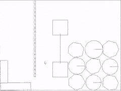
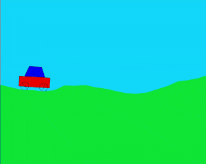

# 2D-physics-engine
 Sequential impulse constraint solver

# Features
 - Circles and convex polygons
 - Friction, restitution
 - Constraints solved on velocity with Baumgarte stabilization and customizable stiffness (see [Random](https://raw.githack.com/JentGent/2D-physics-engine/main/demos/random.html) right click and drag or [Car](https://raw.githack.com/JentGent/2D-physics-engine/main/demos/car.html) wheels)
    - "Anchor": set point on body A
    - "Distance": set distance between point on A and point on B
    - "Union": join two bodies together (build complex shapes)
    - "Joint": point on A = point on B
 - Collision layers

# Demos

## [Random](https://raw.githack.com/JentGent/2D-physics-engine/main/demos/random.html)
Left click to grab; right click to pull

## [Car](https://raw.githack.com/JentGent/2D-physics-engine/main/demos/car.html)
RIGHT/D to accelerate wheels clockwise
LEFT/D to accelerate wheels counter-clockwise
UP/W to tilt clockwise
DOWN/S to tilt counter-clockwise

